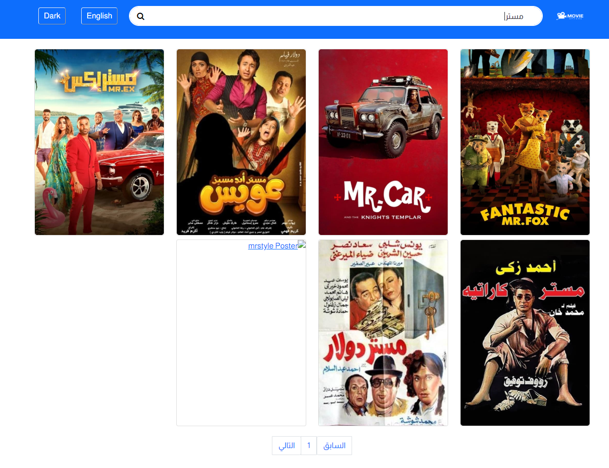

# MovieSphere

MovieSphere is a modern React-based web application that allows users to explore and discover popular movies. The app fetches movie data from The Movie Database (TMDb) API and presents it in an intuitive, user-friendly interface. Users can browse through movie lists, view movie details, search for specific movies, and navigate through pages of results.

## Features

- **Browse popular movies**: Explore trending movies fetched from TMDb.
- **Movie search**: Search for movies by title and view results instantly.
- **Pagination**: Easily navigate through multiple pages of movie results.
- **Multi-language support**: Toggle between Arabic and English for both UI and content.
- **Movie details**: View detailed information about each movie, including title, overview, rating, genres, and images.
- **Dark mode support**: Toggle between light and dark themes to enhance user experience.
- **Responsive design**: Optimized for mobile, tablet, and desktop views.

## Additional Features (Planned)

- **Favorite movies**: Allow users to mark movies as favorites and view them later.
- **User authentication**: Implement user login and signup functionality for personalized experiences.
- **Movie trailers**: Show trailers for movies, if available.
- **Recommendations**: Display recommended movies based on user preferences and previous selections.

## Tech Stack

- **Frontend**: React.js
- **Backend**: None (uses the TMDb API)
- **Styling**: React Bootstrap, custom CSS
- **API**: The Movie Database (TMDb) API

## Screenshots

Here’s a preview of the MovieSphere app:

## Getting Started

To get started with MovieSphere, follow the steps below to clone and run the project locally:

### Prerequisites

Ensure you have the following installed:

- **Node.js**: Download and install Node.js
- **npm**: Comes with Node.js installation

#### Clone the repository

- git clone https://github.com/YousifAdel170/moviesphere.git
- cd moviesphere

#### Install dependencies

Run the following command to install the necessary dependencies:

- npm install

#### Set up the TMDb API key

To fetch movie data from TMDb, you'll need to sign up on TMDb and generate an API key.

1. Go to TMDb API and sign up if you don't have an account.
2. Generate an API key
3. Create a .env file in the root of your project and add the following line:
   REACT_APP_TMDB_API_KEY=your-api-key-here

### Run the app

Now that everything is set up, start the development server:

- npm start
- Visit http://localhost:3000 in your browser to see the app in action.

## How It Works

1. **Fetching Movie Data**: The app fetches movie data using the TMDb API based on the selected language and page number.
2. **Pagination**: The app handles pagination, allowing users to navigate through multiple pages of movie results.
3. **Search Functionality**: Users can search for specific movies by title, and the app fetches and displays the results accordingly.
4. **Language Toggle**: The app supports toggling between Arabic and English, updating both the UI and the content based on the selected language.
5. **Theme Toggle**: Switch between dark and light modes for a customized viewing experience. This can be achieved using a button that toggles a dark-mode class or a React context to manage the theme state.
6. **Responsive Design**: The app is built to be fully responsive, making it easy to use on mobile, tablet, and desktop devices.

## Contributing

If you'd like to contribute to this project, feel free to fork the repository, make your changes, and create a pull request. We welcome suggestions, bug fixes, and improvements!

## License

This project is open-source.

## Contact

Feel free to reach out via LinkedIn or email me at ya842245@gmail.com for any questions or feedback.
